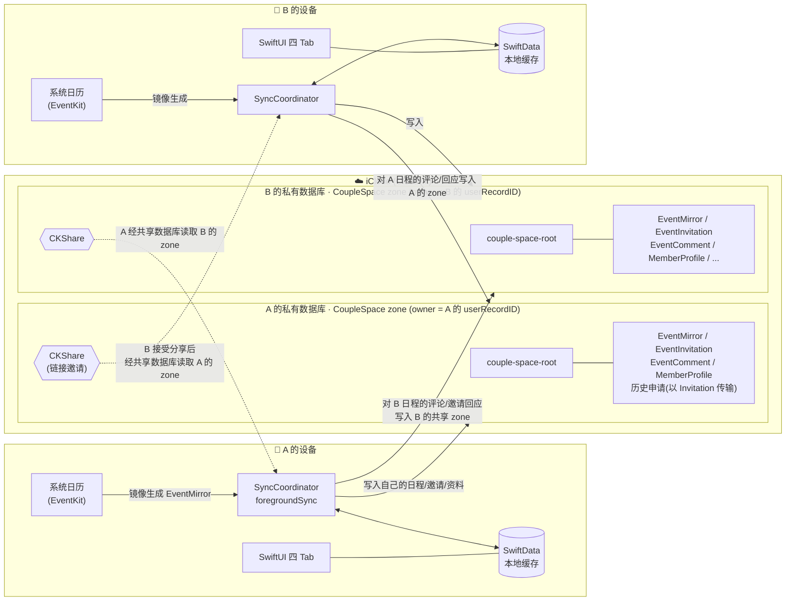
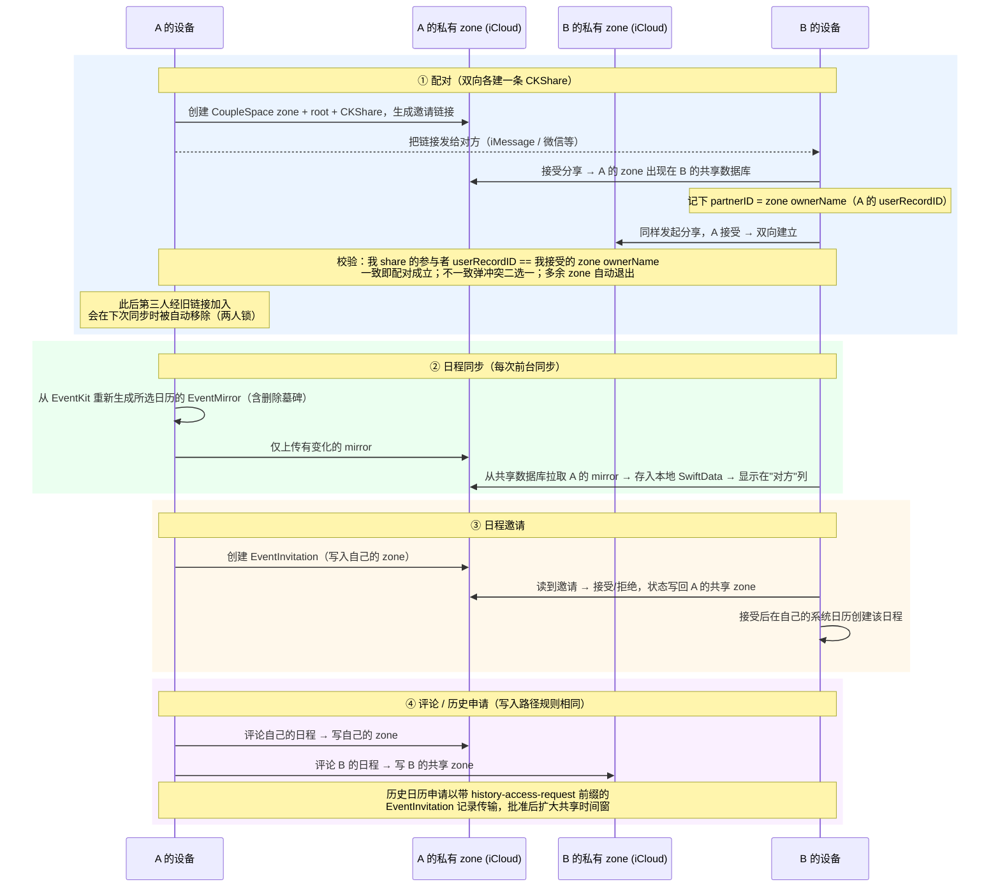

# ShareCal（CoupleCalendar）

ShareCal 是一款**严格两人配对**的情侣共享日历 iOS App：双方各自挑选要共享的系统日历，App 将所选日程镜像到 iCloud 并通过一条 CKShare 互相可见。不上传账号密码、不依赖任何自建服务器——所有数据只存在于两个人自己的 iCloud 中。

## 功能特性

- **两人配对**：通过 iCloud 共享链接配对；配对确立后，经旧链接加入的第三人会在同步时被自动移除；接受陌生人的分享会触发"更换配对"确认，多余的历史共享自动退出。
- **日程同步**：从系统日历（EventKit）镜像所选日历的日程，支持可见性控制（完整详情 / 仅忙碌）；本地日历的增删改在每次同步时自动收敛，后台也会通过静默推送 + 后台刷新尽力补同步。
- **日程邀请**：给对方发日程邀请，对方接受后自动写入其系统日历；状态（待处理/已接受/已拒绝/已取消）双向同步。
- **日程评论与动态**：对任意一方的日程留言，支持编辑、删除与已读状态；"动态" Tab 按事件聚合双方评论，未读数显示在 Tab 角标。
- **系统通知**：对方评论我的日程、收到/被回应邀请、历史申请及其回复会推送本地通知（仅这几类，纯日历改动不打扰）。
- **历史日历申请**：默认只共享配对日之后的日程；想看配对前的历史需向对方发起申请，对方批准后按时间窗放行。
- **昵称体系**：对方显示为"备注名 > 对方同步的昵称 > 兜底"，不展示邮箱等 iCloud 身份信息。
- **中英双语**：内置中/英文案，可在设置中切换。

## 产品 UI

App 为四个 Tab 的标准 iOS 结构：

| Tab | 内容 |
| --- | --- |
| **日历** | 日 / 周视图，"我"与"对方"双列时间轴，重叠日程并列展示；点击日程查看详情与评论 |
| **动态** | 跨日程的评论动态流，按事件聚合、最新在前；未读（对方新评论）数显示在 Tab 角标 |
| **邀请** | 收到的日程邀请与历史日历申请的待办列表（Tab 角标提示未处理数量） |
| **设置** | 配对状态卡（发起配对 / 解除配对 / 同步 / 申请历史）、昵称与备注、共享日历选择、默认可见性、语言、删除 iCloud 数据 |

| 日历 | 动态 | 邀请 | 设置 |
| --- | --- | --- | --- |
|  |  |  |  |

## 技术栈

| 层 | 技术 |
| --- | --- |
| UI | SwiftUI（`@Observable`），无第三方依赖 |
| 本地存储 | SwiftData（仅作本地缓存，`cloudKitDatabase: .none`）+ UserDefaults（设置与配对状态） |
| 云同步 | CloudKit：私有数据库自有 `CoupleSpace` zone + CKShare 层级共享；`CKSyncEngine` 推送变更 |
| 系统日历 | EventKit（读取所选日历、为接受的邀请创建日程） |
| 身份 | CloudKit `userRecordID` 作为唯一成员 ID（即共享 zone 的 ownerName，无自建账号体系） |
| 测试 | XCTest，决策逻辑收敛在无状态 "Plan enum" 中直接单测 |
| 最低系统 | iOS 18.0 |

## 数据同步架构

两人各自拥有一个私有 `CoupleSpace` zone，所有记录挂在 `couple-space-root` 根记录下，由一条 CKShare 整体共享给对方；对方通过共享数据库（sharedCloudDatabase）读取。**zone 的 ownerName 就是数据归属的权威身份**。



各类数据的完整流转（配对 → 日程 → 邀请 → 评论）：



要点：

- **配对身份只有一套**：成员 ID = CloudKit `userRecordID`，天然等于 zone 的 ownerName，没有本地 UUID、没有 pairingID，"对方是谁"由 `TwoPersonPairingPlan` 单点裁决。
- **镜像是派生数据**：自己的 EventMirror 每次同步都从 EventKit 重建，SwiftData 只是缓存，删库重装后重新同步即可恢复。
- **写入路径规则**：自己的数据写自己的私有 zone；针对对方数据的回应（评论、邀请状态、申请批复）写进对方的共享 zone。

## 开发

```bash
# 构建
xcodebuild -project CoupleCalendar.xcodeproj -scheme CoupleCalendar \
  -destination 'platform=iOS Simulator,name=iPhone 17 Pro' build

# 单元测试
xcodebuild -project CoupleCalendar.xcodeproj -scheme CoupleCalendar \
  -destination 'platform=iOS Simulator,name=iPhone 17 Pro' test -only-testing:CoupleCalendarTests
```

- 代码架构与约定见 [CLAUDE.md](CLAUDE.md)。
- CloudKit Schema 部署、固定双模拟器冒烟测试、停止共享隐私验证等运维流程见 [docs/development.md](docs/development.md)。

## 开源协议

本项目采用 [MIT 协议](LICENSE) 开源，可自由使用、修改与分发，仅需保留版权与许可声明。

## 致谢

- [SeemSeam/plan-tree](https://github.com/SeemSeam/plan-tree) —— 本项目开发时使用的规划工作流 skill（作为本地工具使用，不随仓库分发），感谢其作者。
